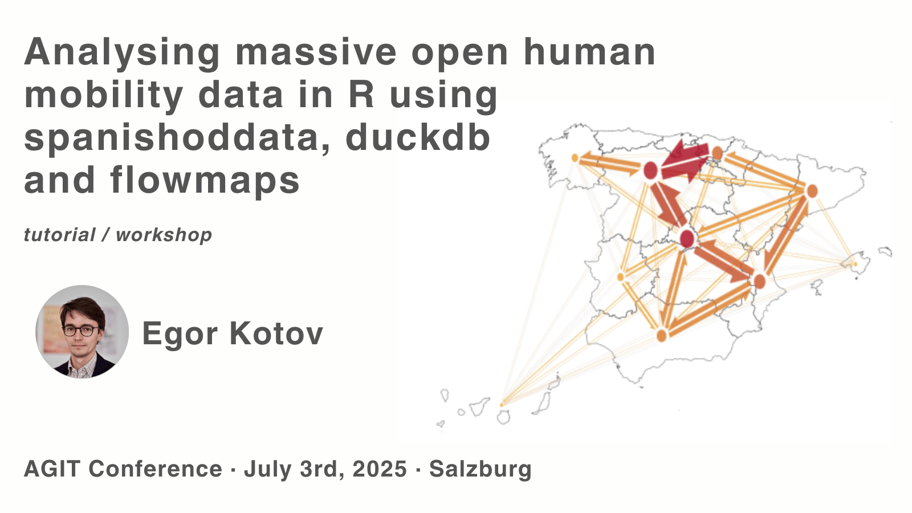

This repository is part of the workshop and tutorial "Analysing massive open human mobility data in R using spanishoddata, duckdb and flowmaps" workshop at AGIT 2025 conference [https://agit.at/en/](https://agit.at/en/) in Salzburg. It contains the scripts for examples and exercises presented during the workshop.

## Run this repository in RStudio with just your web browser using Binder. Push the button >> 

The website with the workshop materials and slides is available at: [https://www.ekotov.pro/agit-2025-spanishoddata](https://www.ekotov.pro/agit-2025-spanishoddata)
